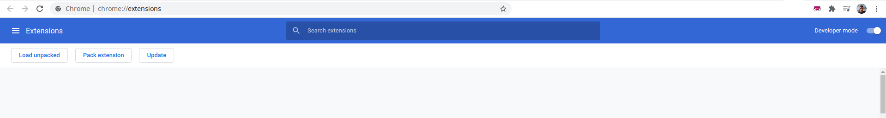

# IG Landscape

This extension aims to make it possible to enjoy Live and IGTV videos, full-screen and landscape, by removing all elements on screen except the video playing and rotate video (±90 & 180deg).

## install

Clone this repository, or [download .zip](https://mahdigh.ir/iglive/iglive.zip) open chrome and activate the [developer mode](chrome://extensions/):

then, click on `Load extension` button and choose the address of extension root directory.

### Chrome extension?

Go checkout my presentation on Developing Chrome Extensions, [here on ludus](https://app.ludus.one/c8b8a6b8-5807-4282-bfaa-ae044205aace).
